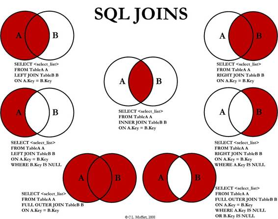

Links salvos: [DevMedia](./joins-devmedia.html) e [StackOverflow](./join-stackoverflow.html)
### INNER JOIN
Consiste na inserseção de valores entre duas tabelas:
<pre><code>SELECT a.col, b.col
FROM tb_a AS a
INNER JOIN tb_b AS b ON b.col = a.col;</code></pre>
### OUTER JOIN
Consiste na interseção e dos valores "órfãos" de cada tabela:
<pre><code>SELECT 
  t.Name, p.PlaylistId
FROM Track t LEFT JOIN PlaylistTrack p ON p.TrackId = t.TrackId
UNION
SELECT
  t.Name, p.PlaylistId
FROM Track t RIGHT JOIN PlaylistTrack p ON p.TrackId = t.TrackId;</code></pre>
### OUTER EXCLUDING JOIN
Consiste num RIGHT EXCLUDING JOIN + LEFT EXCLUING JOIN:
<pre><code>SELECT
	l.titulo, a.`name`
FROM
	livros l LEFT JOIN autores a ON a.autor_id = l.autor_id
WHERE a.autor_id IS NULL
UNION
SELECT
	l.titulo, a.`name`
FROM
	livros l RIGHT JOIN autores a ON a.autor_id = l.autor_id
WHERE l.autor_id IS NULL;</code></pre>
### RIGHT JOIN
Todos os registros da segunda tabela especificiada:
<pre><code>SELECT
	a.col, b.col
FROM
	tb_a AS a RIGHT JOIN tb_b AS b
		ON b.col = a.col;</code></pre>
### LEFT JOIN
Todos os valores da primeira tabela especificada:
<pre><code>SELECT
	a.col, b.col
FROM
	tb_a AS a LEFT JOIN tb_b AS b
		ON b.col = a.col;</code></pre>
### RIGHT EXCLUDING JOIN
Apenas os registros da segunda tabela que sejam "órfãos"
<pre><code>SELECT
	t.Name, p.PlaylistId
FROM 
	PlaylistTrack p RIGHT JOIN Track t
		ON t.TrackId = p.TrackId
WHERE
	p.PlaylistId IS NULL;</code></pre>
### LEFT EXCLUDING JOIN
Apenas os registros da primeira tabela que sejam órfãos:
<pre><code>SELECT
	g.GenreId, g.Name
FROM 
	Genre AS g LEFT JOIN Track AS t 
		ON t.GenreId = g.GenreId  
WHERE t.GenreId IS NULL;</code></pre>